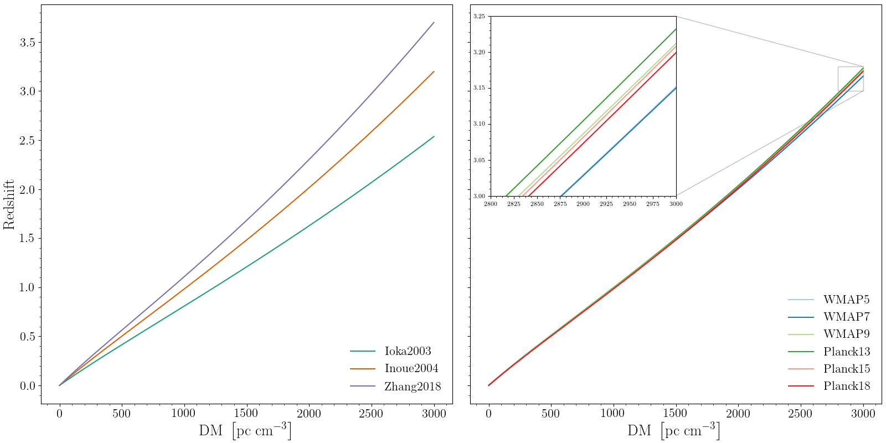

# Summary

``fruitbat`` is a Python 2/3 package for estimating redshifts, energies and the galactic dispersion measure contributions of fast radio bursts (FRBs).

FRBs are a class of short duration (~ 30 ms) transient radio sources of unknown extragalactic origin (@Lorimer2007, @Thornton2013, @Petroff2015, @CHIME2019). There is currently at least 65 confirmed FRB detections (@Petroff2016), while the new CHIME telescope is expected to add of order 10 FRBs per day (@Chawla2017).

The defining feature of FRBs, and one that sets them apart from other radio transient events, is their extremely high dispersion measure (DM), generated by the integration of free electron column density along the line-of-sight. FRBs have DM values significantly larger than the estimated Milky Way contribution along the line-of-sight can provide, leading many to believe that their origin is extragalactic. The extragalactic origin of FRBs was confirmed with the host galaxy localisation of a repeating FRB (FRB 121102) to a redshift of $z = 0.197$ (@Tendulkar2017).

Unfortunately most telescopes do not have high enough resolution to unambiguously localise the host galaxies of FRBs and instead an upper limit of their redshifts can be estimated using a DM-redshift relation; typically calculated via analytical means (e.g. @Ioka2003, @Inoue2004, @Zhang2018).

We have constructed the tool ``fruitbat`` to assist the estimation of redshifts and galactic DM values of FRBs. ``fruitbat`` generates and utilises 'look-up tables' of existing DM-redshift relations found in the literature (@Ioka2003, @Inoue2004, @Zhang2018) in conjunction with cosmological parameters determined from both the WMAP (@WMAP5, @WMAP7, @WMAP9) and Planck missions (@Planck13, @Planck15, @Planck18). 

``fruitbat`` allows the user to independently choose the DM-redshift relation and the cosmological parameters which was typically not an option when using the relations from the literature. Additionally, ``fruitbat`` explicitly integrates the entire DM-redshift relation at each redshift instead of assuming an average value across redshifts; an assumption that introduces a 6\% error (see Equation (6) in @Zhang2018). In Figure 1 we compare the different DM-redshift relations and cosmologies that have been built into ``fruitbat``.

Furthermore, ``fruitbat`` has the functionality for users to define their own DM relations, create custom cosmologies (including non-$\Lambda$CDM cosmologies) and generate their own look-up tables. This feature in particular allows for much greater flexibility than existing techniques in the analysis of FRBs as well as providing the option of adding non-analytical DM-redshift relations such as those derived from cosmological simulations. 

To account for the galactic DM contribution due to electrons in the interstellar and circumgalactic medium, ``fruitbat`` utilises the YMW16 galactic free electron density model (@Yao2017) to estimate the line-of-sight DM of the Milky Way.

In addition to estimating the redshifts and the line-of-sight galactic DM, ``fruitbat`` also has the capability to calculate other quantities of FRBs including: luminosity distances, comoving distance, burst energy and average luminosity.

``fruitbat`` was developed due to a need for a tool that can utilise DM-redshift relations derived analytically and from cosmological simulations (Batten et al. in prep). ``fruitbat`` has since been used by Price et al. (MNRAS accepted) to estimate the redshift of FRB 180301.

``fruitbat`` is released under the BSD 3-Clause licence, and is avaliable from PyPi via ``pip``; the ``fruitbat`` source code can be found at https://github.com/abatten/fruitbat; tutorials for getting started with ``fruitbat`` and online documentation can be found at https://fruitbat.readthedocs.io.

# Acknowledgements
The author would like to thank Alan Duffy, Ellert van der Velden and Daniel Price for their helpful discussions during the development of this project. The author would also like to thank James Josephides for designing the ``fruitbat`` logo. This research was supported by the Australian Research Council Centre of Excellence for All Sky Astrophysics in 3 Dimensions (ASTRO 3D), through project number CE170100013 .

# References
